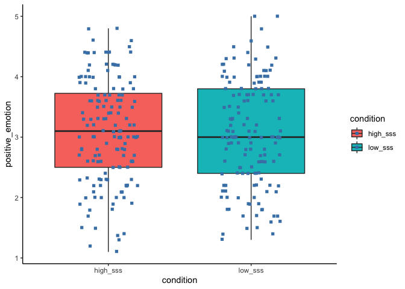
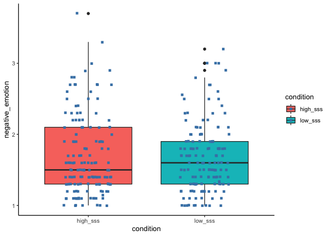
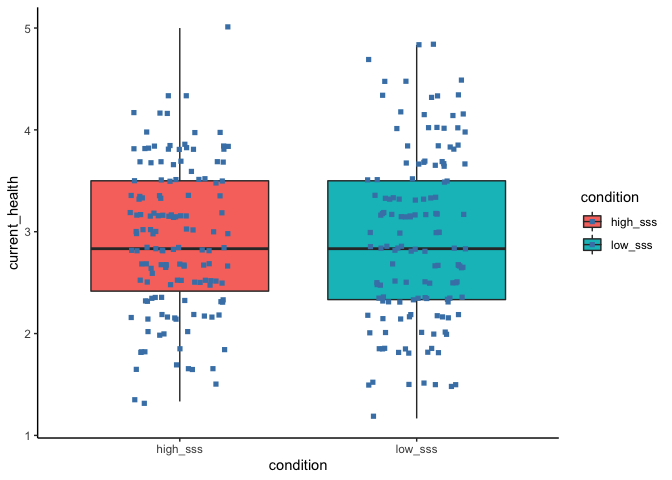
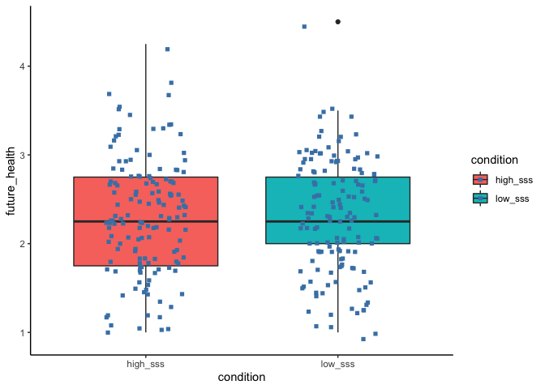
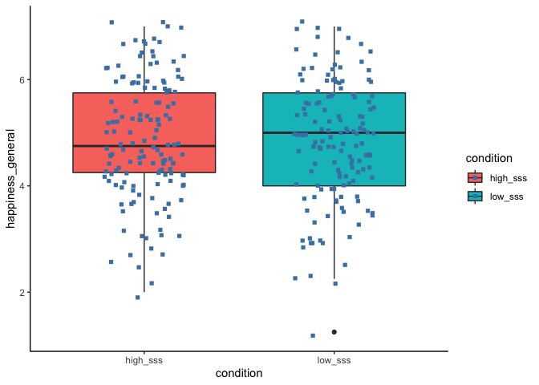
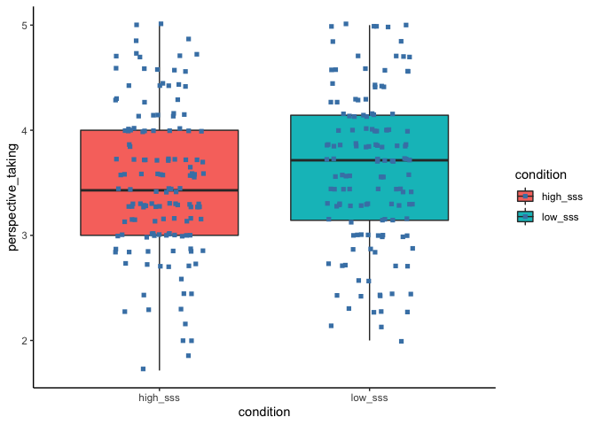

basic analysis
================

``` r
library(dplyr)
```

    ## 
    ## Attaching package: 'dplyr'

    ## The following objects are masked from 'package:stats':
    ## 
    ##     filter, lag

    ## The following objects are masked from 'package:base':
    ## 
    ##     intersect, setdiff, setequal, union

``` r
library(tidyverse)
```

    ## ─ Attaching packages ──────────────────── tidyverse 1.3.0 ─

    ## ✓ ggplot2 3.3.3     ✓ purrr   0.3.4
    ## ✓ tibble  3.1.0     ✓ stringr 1.4.0
    ## ✓ tidyr   1.1.2     ✓ forcats 0.5.1
    ## ✓ readr   1.4.0

    ## ─ Conflicts ───────────────────── tidyverse_conflicts() ─
    ## x dplyr::filter() masks stats::filter()
    ## x dplyr::lag()    masks stats::lag()

``` r
library(ggplot2)
library(psych)
```

    ## 
    ## Attaching package: 'psych'

    ## The following objects are masked from 'package:ggplot2':
    ## 
    ##     %+%, alpha

# import the data

``` r
library(readr)
thesis <- read_csv("thesis.csv")
```

    ## Warning: Missing column names filled in: 'X1' [1]

    ## 
    ## ─ Column specification ────────────────────────────
    ## cols(
    ##   .default = col_double(),
    ##   condition = col_character(),
    ##   procedure = col_character(),
    ##   Q132 = col_number()
    ## )
    ## ℹ Use `spec()` for the full column specifications.

``` r
View(thesis)
```

# rename variables

``` r
thesis <- thesis %>%
  rename(exercise_frequency = Q142, 
         birthdate = Q128,
         gender = Q130,
         ethinicity = Q132,
         SES = Q134)
```

\#\#\#1. Manipulation

``` r
#participant number in each condition
table(thesis$condition)
```

    ## 
    ## high_sss  low_sss 
    ##      144      141

``` r
#there are 144 people in the high sss condition and the rest of 141 in the low sss condition.
```

``` r
#manipulation check
table(thesis$condition,thesis$manipulation_check)
```

    ##           
    ##              1   2   3
    ##   high_sss 134   9   1
    ##   low_sss    9  10 122

``` r
"1 = high, 2 = middle, 3 = low"
```

    ## [1] "1 = high, 2 = middle, 3 = low"

``` r
"in the high sss condition, 9 of them chose 'middle' and one chose 'low'. 
in the low sss condition, 9 of them people chose 'high' and 10 people chose 'middle'.
Maybe people chose 'middle' because it kind of reflected their current status?"
```

    ## [1] "in the high sss condition, 9 of them chose 'middle' and one chose 'low'. \nin the low sss condition, 9 of them people chose 'high' and 10 people chose 'middle'.\nMaybe people chose 'middle' because it kind of reflected their current status?"

\#\#\#2. National SSS

``` r
summary(thesis)
```

    ##        X1            id         condition          national_sss   
    ##  Min.   :  1   Min.   :21332   Length:285         Min.   : 1.000  
    ##  1st Qu.: 72   1st Qu.:21917   Class :character   1st Qu.: 6.000  
    ##  Median :143   Median :22125   Mode  :character   Median : 7.000  
    ##  Mean   :143   Mean   :22037                      Mean   : 7.123  
    ##  3rd Qu.:214   3rd Qu.:22284                      3rd Qu.: 8.000  
    ##  Max.   :285   Max.   :22449                      Max.   :10.000  
    ##                NA's   :1                                          
    ##   procedure         manipulation_check exercise_frequency positive_emotion
    ##  Length:285         Min.   :1.00       Min.   :1.000      Min.   :1.100   
    ##  Class :character   1st Qu.:1.00       1st Qu.:1.000      1st Qu.:2.400   
    ##  Mode  :character   Median :1.00       Median :2.000      Median :3.000   
    ##                     Mean   :1.93       Mean   :2.018      Mean   :3.072   
    ##                     3rd Qu.:3.00       3rd Qu.:3.000      3rd Qu.:3.800   
    ##                     Max.   :3.00       Max.   :4.000      Max.   :5.000   
    ##                                                                           
    ##  negative_emotion current_health  future_health   happiness_wake 
    ##  Min.   :1.000    Min.   :1.167   Min.   :1.000   Min.   :1.500  
    ##  1st Qu.:1.300    1st Qu.:2.667   1st Qu.:2.750   1st Qu.:3.750  
    ##  Median :1.600    Median :3.000   Median :3.000   Median :4.750  
    ##  Mean   :1.691    Mean   :3.022   Mean   :2.872   Mean   :4.712  
    ##  3rd Qu.:2.000    3rd Qu.:3.333   3rd Qu.:3.250   3rd Qu.:5.500  
    ##  Max.   :3.700    Max.   :4.333   Max.   :4.000   Max.   :7.000  
    ##                   NA's   :1       NA's   :3                      
    ##  happiness_general exercise_intent  empathetic_concern perspective_taking
    ##  Min.   :1.250     Min.   :  0.00   Min.   :1.857      Min.   :1.714     
    ##  1st Qu.:4.250     1st Qu.: 39.84   1st Qu.:3.571      1st Qu.:3.000     
    ##  Median :4.750     Median : 52.56   Median :4.143      Median :3.571     
    ##  Mean   :4.859     Mean   : 53.45   Mean   :3.999      Mean   :3.556     
    ##  3rd Qu.:5.750     3rd Qu.: 68.75   3rd Qu.:4.429      3rd Qu.:4.000     
    ##  Max.   :7.000     Max.   :100.00   Max.   :5.000      Max.   :5.000     
    ##                    NA's   :2        NA's   :1                            
    ##    birthdate        gender        ethinicity            SES       
    ##  Min.   :1997   Min.   :1.000   Min.   :      11   Min.   :1.000  
    ##  1st Qu.:2001   1st Qu.:1.000   1st Qu.:      51   1st Qu.:4.000  
    ##  Median :2002   Median :1.000   Median :      51   Median :5.000  
    ##  Mean   :2002   Mean   :1.361   Mean   :  147117   Mean   :4.423  
    ##  3rd Qu.:2003   3rd Qu.:2.000   3rd Qu.:      51   3rd Qu.:5.000  
    ##  Max.   :2004   Max.   :2.000   Max.   :41392123   Max.   :5.000  
    ##  NA's   :9                                         NA's   :1

``` r
ggplot(thesis, aes(x = national_sss)) +
      geom_histogram(binwidth = 0.5) +
      facet_grid(.~condition)
```

<!-- -->

\#\#\#3. Emotion

``` r
ggplot(thesis, aes(x = condition, y = positive_emotion, fill = condition)) +
    geom_boxplot() +
    geom_jitter(shape = 15,
        color = "steelblue",
        position = position_jitter(0.21)) +
    theme_classic()
```

<!-- -->

``` r
ggplot(thesis, aes(x = condition, y = negative_emotion, fill = condition)) +
    geom_boxplot() +
    geom_jitter(shape = 15,
        color = "steelblue",
        position = position_jitter(0.21)) +
    theme_classic()
```

<!-- -->

``` r
#within high condition, whether positive emotion is significantly higher than negative emotion.
```

\#\#\#4. Health

``` r
ggplot(thesis, aes(x = condition, y = current_health, fill = condition)) +
    geom_boxplot() +
    geom_jitter(shape = 15,
        color = "steelblue",
        position = position_jitter(0.21)) +
    theme_classic()
```

    ## Warning: Removed 1 rows containing non-finite values (stat_boxplot).

    ## Warning: Removed 1 rows containing missing values (geom_point).

<!-- -->

``` r
ggplot(thesis, aes(x = condition, y = future_health, fill = condition)) +
    geom_boxplot() +
    geom_jitter(shape = 15,
        color = "steelblue",
        position = position_jitter(0.21)) +
    theme_classic()
```

    ## Warning: Removed 3 rows containing non-finite values (stat_boxplot).

    ## Warning: Removed 3 rows containing missing values (geom_point).

<!-- -->

\#\#\#5. Happiness

``` r
ggplot(thesis, aes(x = condition, y = happiness_wake, fill = condition)) +
    geom_boxplot() +
    geom_jitter(shape = 15,
        color = "steelblue",
        position = position_jitter(0.21)) +
    theme_classic()
```

<!-- -->

``` r
ggplot(thesis, aes(x = condition, y = happiness_general, fill = condition)) +
    geom_boxplot() +
    geom_jitter(shape = 15,
        color = "steelblue",
        position = position_jitter(0.21)) +
    theme_classic()
```

<!-- -->

\#\#\#6. Exercise

``` r
ggplot(thesis, aes(x = condition, y = exercise_intent, fill = condition)) +
    geom_boxplot() +
    geom_jitter(shape = 15,
        color = "steelblue",
        position = position_jitter(0.21)) +
    theme_classic()
```

    ## Warning: Removed 2 rows containing non-finite values (stat_boxplot).

    ## Warning: Removed 2 rows containing missing values (geom_point).

<!-- -->
\#\#\#7. Empathy

``` r
ggplot(thesis, aes(x = condition, y = empathetic_concern, fill = condition)) +
    geom_boxplot() +
    geom_jitter(shape = 15,
        color = "steelblue",
        position = position_jitter(0.21)) +
    theme_classic()
```

    ## Warning: Removed 1 rows containing non-finite values (stat_boxplot).

    ## Warning: Removed 1 rows containing missing values (geom_point).

<!-- -->

``` r
ggplot(thesis, aes(x = condition, y = perspective_taking, fill = condition)) +
    geom_boxplot() +
    geom_jitter(shape = 15,
        color = "steelblue",
        position = position_jitter(0.21)) +
    theme_classic()
```

<!-- -->

\#\#\#8. Ethnicity

``` r
thesis %>%
  mutate(race = recode(ethinicity,
                        "41" = "American Indian/Alaskan Native",
                        "11" = "East Asian" ,
                        "12" = "Southeast Asian",
                        "13" = "South Asian",
                        "19" = "Other Asian",
                        "31" = "Mexican American/Chicano",
                        "32" = "Puerto Rican",
                        "33" = "Central American",
                        "39" = "Other Hispanic or Latino",
                        "21" = "African American/Black",
                        "22" = "African",
                        "23" = "Caribbean",
                        "29" = "Other Black",
                        "51" = "European/European American",
                        "52" = "Middle Eastern/Middle Eastern American",
                        "59" = "Other White",
                        "42" = "Native Hawaiian or Other pacific Islander",
                        "89" = "Other",
                        "99" = "Not Specified"
                       ))
```

    ## Warning: Unreplaced values treated as NA as .x is not compatible. Please specify
    ## replacements exhaustively or supply .default

    ## # A tibble: 285 x 21
    ##       X1    id condition national_sss procedure                 manipulation_ch…
    ##    <dbl> <dbl> <chr>            <dbl> <chr>                                <dbl>
    ##  1     1 21678 high_sss             8 It was a remarkable expe…                1
    ##  2     2 21811 high_sss             3 After seeing my old frie…                1
    ##  3     3 21340 high_sss             7 I would definitely be ve…                1
    ##  4     4 21415 high_sss             8 I would feel very powerf…                1
    ##  5     5 21759 high_sss             9 If I was at the top of t…                1
    ##  6     6 21816 high_sss             7 I would feel very accomp…                1
    ##  7     7 21341 high_sss             7 I would feel very please…                1
    ##  8     8 21802 high_sss             7 I would look for those a…                1
    ##  9     9 21349 high_sss             5 I attended my 5-year col…                1
    ## 10    10 21494 high_sss             7 Being at the top of the …                1
    ## # … with 275 more rows, and 15 more variables: exercise_frequency <dbl>,
    ## #   positive_emotion <dbl>, negative_emotion <dbl>, current_health <dbl>,
    ## #   future_health <dbl>, happiness_wake <dbl>, happiness_general <dbl>,
    ## #   exercise_intent <dbl>, empathetic_concern <dbl>, perspective_taking <dbl>,
    ## #   birthdate <dbl>, gender <dbl>, ethinicity <dbl>, SES <dbl>, race <chr>

\#\#\#9. Age

``` r
thesis$age <- 2021 - thesis$birthdate
```
